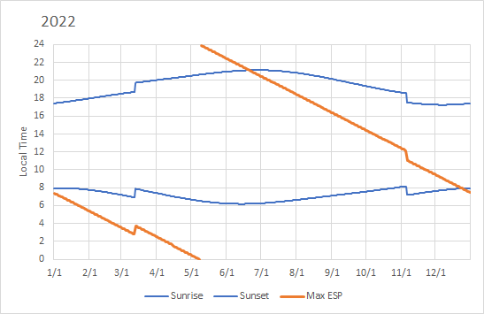
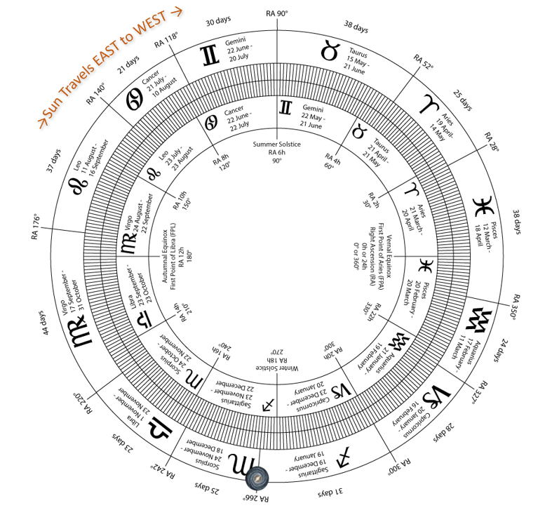

# Astronomy

## Motivation

I've always wanted to learn more about calculating positions of stars and planets.  I'm impressed by software that can do this and accurately provide these celestial positions at any moment in time.  But the motivation for this project came when a book I was reading mentioned a belief that remote viewing clarity reaches a maximum at 13.5 Local Sidereal Time (LST) and hypothesized that this might be due to the relative position of the center of the Milky Way Galaxy.  The author produced a chart that showed the local time corresponding to 13.5 LST on each day of a sample year for his location.

What the heck is Local Sidereal Time?  How do you calculate it for different locations on Earth? And what direction is the center of the galaxy?  There are plenty of calculators online that will calculate LST for you at different times and for different locations and there are plenty of good star chart apps you can get for your phone.  But finding the location of the galaxy's center (and being able to understand the coordinates that websites give for this location) is a bit trickier.  This is what finally motivated me to learn how to calculate astronomical locations myself.

My primary goal was to be able to re-create the chart I had seen in the book.  I thought this might take 2 or 3 hours. It ended up taking all day.  I also ended up learning a lot about basic astronomy along the way and found that I really enjoyed this.  Ultimately, I spent about 20 hours working on this package, trying to get the calculations right, and then trying to refactor it into something decent-looking.  It still has some rough edges, but it works.  And here's the chart showing 13.5 LST for my location in 2022.  It shows sunrise and sunset times (as did the one I was copying) and accounts for daylight savings time (something I didn't see in the original inspiration, but maybe that author lived in a location that didn't adjust their clocks.)  Here it is:



I also came across the chart below during this research which shows the celestial locations of the constellations of the Zodiac and contrasts these with the locations and dates that are typically associated with them in horoscopes.  There has been almost a whole month's worth of drift since the reference period (about 130 BCE), shifting many people into a completely different house.  Being able to perform the calculations needed to build this chart myself became another motivation to implement more of the methods from Astronomical Algorithms.  I also added the location of the galactic center to the chart:



## References

I couldn't have done any of this without the book Astronomical Algorithms (v2) by Meeus that provides excellent detail on a variety of calculations and also contains enough information about astronomical terms so that you can begin to understand the fundamental concepts needed to apply them.  You can find this book online.  If I had to do this again - or if I decide to extend this library in the future - I might also rely on the International Astronomy Society's [SOFA Implementation of astronomical algorithms](https://www.iausofa.org/) since some of the approaches Meeus uses are a bit out-dated.  This is something I wasn't aware of until I had finished this project.

## Design Decisions

### Code Organization

The algorithms in Astronomical Algorithms are implemented in their own package with a class corresponding to each chapter.  This was convenient since the book references its algorithms by chapter, referencing algorithm "7.1" for instance to reference the first algorithm in chapter 7.  When possible, I also implemented unit tests using sample calculations in the book to verify they produce the correct results.

Nobody wants to use code organized this way though.  We don't want to have to know that Chapter 7 contains algorithms pertaining to Julian Dates or have to call this function as ```Chapter7.julianDateFor(...)```.  For this reason, I also tried to create more user-friendly classes with meaningful names and helpful methods.  This is where my amateur-ish knowledge of astronomy is prone to make silly mistakes though.  These classes delegate the real work to the implementations of Meeus's algorithms, sometimes having to marshall information to and from the package using data structures specific to these algorithms.  This design makes the Meeus algorithms easily portable (so anyone can steal or re-use them if they want to) while leaving flexibility in the main library to use different implementations of algorithms if desired.  Future implementations of algorithms from other sources should similarly be grouped into their own packages without external dependencies.

### Angle Objects

It doesn't take long working with astronomical algorithms before you realize that geometric angles can be a little problematic.  Calculations typically need to be done in radians while some algorithms expect degrees.  There are also times where defining a circle with 24 hours is helpful.  We frequently input and output angles in various formats as well such as:

* 120d 15' 12.5"  (where d is the degrees symbol)
* 120.25347222222223 degrees
* 8.01689814814815 hours
* 8h 1m 0.83s

In order to clarify what units are being used and help ensure correct results are obtained, an abstract Angle class is defined with implementations of Radians, Degrees, and Hours.  The main package always allows the abstract Angle to be used as a parameter.  This can easily be converted to any of the other implementations using ```toRadians()```, ```toDegrees()```, and ```toHours()```.  The trigonometric functions ```sin()```, ```cos()```, ```tan()``` and friends are defined on the abstract Angle class.  Internally, the angle just gets converted to radians since this is used by Java's Math class to calculate them.  Methods such as addition and subtraction of angles are delegated to the implementations so that they can be performed with minimal overhead and without changing the class of the Angle.

These Angle objects do add some overhead.  They are intended more for clarity of code than for computational speed.  They are not intended to be used in the implementation of astronomical algorithms.  Using them there would introduce undesirable dependencies on objects from this package and make the core algorithms less portable.  Instead, it is common to see the algorithms themselves always expect angles to be represented in a specific unit (such as degrees for Meeus) and use these consistently throughout their package. A helper class such as TrigDegrees can be used to calculate trigonometric functions with the understanding that all units will be in a specific unit such as degrees.

## Key Concepts

I was surprised to learn just how much astronomical knowledge is needed not just to define astronomical algorithms but also to understand how to use these algorithms.  This section will lay out the key concepts needed to make use of this library.

### Julian Dates and Astronomical Calendars

[Julian Dates](https://en.wikipedia.org/wiki/Julian_day) are fundamental to many astronomical calculations.  This provides a continuous count of days that is very useful in performing calculations.  Day 1 is defined as noon on the first day of the year 4713 BCE.  Astronomers refer to this as the year -4712 so that years are also defined on a continuous scale without the jump from 1 BCE to 1 CE.  The astronomical year 0 refers to 1 BCE and any year before this will be 1 year off from the BCE years as commonly used.  A "Julian Date" combines the integer representing the Julian Day with a fractional value representing the time-of-day.  An example of a Julian Date is (representing the date and time I am writing this): 2459806.2623264.  The fractional component is based on the 24 hours in a day (86,400 seconds with an extra second added in if the date in question includes the rare "leap second") as measured from Greenwich.

One oddity of the calendar that appears if you go back before October of 1852 is the switching of calendars from the Julian to the Gregorian Calendar.  This transition happened locally in different parts of the world during different years, but astronomers use the transition dates specified in the Gregorian reform where Thursday 4 October 1582 was followed by Friday 15 October 1582.  This gap in the Gregorian calendar doesn't show up in Julian Dates since the count of days since -4712 isn't affected by it.  However, Java's ZonedDateTime object does not take this into account (since ZonedDateTime follows the ISO-8601 specification).  So there will be differences in the moments of history defined by ZonedDateTime and the AstronomicalDate object we created for dates prior to 15 October 1582.

In this library you can create a Julian Date with:

```
JulianDate.from(AstronomicalDate)
JulianDate.from(year, month, day)
JulianDate.from(Instant)
JulianDate.from(ZonedDateTime)  // different results for dates before 1582-10-15
```

The AstronomicalDate and "year, month, day" versions of this are identical and use the astronomical calendar just described.  When Insant is used, the correct calculation should result, since we just compare this instant to a known Instant and JD in time.  Using a ZonedDateTime object may result in errors prior to 15 October 1582 since the implementation of this date calculates 11 days elapsing between 1582-10-04 and 1582-10-15 when it should be only 1.

### Universal Time and Dynamical Time

Another subtlety of date and times involves the difference between Universal Time (UT) and Dynamical Time (TD).  Universal Time is the same as Greenwich Civil Time: the common time we use with 24 hours in a day as calculated at Greenwich, England on the Prime Meridian.  However, there are not always 24 hours in an astronomical day since the rotational speed of the Earth varies subtly over time.  Dynamical Time is calculated by adding a small adjustment factor to UT to account for these changes.  This adjustment differs depending on the year, but it is typically about 60 seconds (and oftentimes less).  You can calculate the offset using:

```
DynamicalTime.offsetForYear(int year)
```

If the fractional component of a day is calculated using Dynamic Time, the result is a Julian Ephemeris Day (JDE).  This is the date used in astronomical calculations since it provides a consistent, uniform time scale.  If you care about precision at this level (typically +/- 60 seconds) you will need to be careful about whether you are providing Julian Dates or Julian Ephemeris Dates to functions.  While we don't create a separate object for JDEs, we do try to note when one is used versus the other in a function by naming the parameter jd or jde.

Since we're on the topic, it is also good to clarify that UT and Greenwich Civil Time are not the same thing as Greenwich Mean Time (GMT).  Astronomers define "mean time" as starting at noon so this is different from UT and civil time by twelve hours.

### Sidereal Time

Sidereal Time is one of the concepts I came across that started this journey.  Sidereal Time is used when describing the location of objects in the sky.  If you know what the local sidereal time is, you will know what stars are directly overhead in your location and what part of the sky is visible.  Sidereal time is first calculated for Greenwich, England (so that we don't need to worry about differences in time zones).  This will tell us what part of the sky is directly over the Prime Meridian.  You can convert Greenwich Mean Sidereal Time (GMST) to Local Mean Sidereal Time (LMST) by adding an offset corresponding to your position on the Earth.  Only your longitude matters in this calculation since you need your offset from the Prime Meridian to describe the rotation of the sky as the earth rotates during a day.

Sidereal time can easily be calculated in this library using the functions:

```
SiderealTime.gmst(JulianDate date)
SiderealTime.lmst(JulianDate date, Angle longitude)
```

The result is an Angle that can be converted to Hours to express the time in a more familiar way.  (The conversion of angles and longitudes on Earth to hours is one interesting concept used frequently in astronomy.)

I also wrote inverse functions to convert a LMST to a LocalTime on a given date, but there is a slight error (no more than a minute or so) in these conversions.  With this inverse function you can create the chart that originally motivated this work by finding the local time corresponding to 13.5 sidereal time on any day for any location.  You'll also need an algorithm to calculate sunrise and sunset to reproduce the chart exactly, but that can be done using the SunriseSunsetCalculator object.

### Equatorial and Ecliptic Coordinates

If you want to produce the Zodiac chart shown earlier, you will need a few more concepts.  First among these is the difference between Equatorial and Ecliptic Coordinates.  The location of stars in the sky is defined using Equatorial Coordinates.  As the Earth revolves around the sun, the tilt of the Earth (the inclination of the ecliptic), and thus the plane that passes through the Earth at the equator remains relatively fixed with respect to the celestial sphere.  We can give the direction of a star as an angle measured within this plane.  This is the object's "right ascension" and is similar to longitude on the Earth.  We also need to know how far off of the plane the object is, so we specify a "declination" which indicates how much above or below the equatorial plane the object is.  This is similar to "latitude" on Earth.  The location of objects in the celestial sphere expressed this way changes very little over time.

Another way to identify objects in the sky is with regard to the plane defined by the movement of the sun through the sky.  This plane aligns with the constellations of the Zodiac since it is the sun's movement through these constellations that defines the houses of the Zodiac.  This plane is also fixed with respect to the celestial sphere, but the path the sun takes through the sky changes throughout the year due to direction of the Earth's tilt with respect to the sun.  This path is the same direction that the stars will take in the night sky and is useful for describing the apparent rotation of the celestial sphere as viewed from Earth.


The last thing we need to specify both of these coordinate systems is a reference point from which to take angles in the plane.  It turns out that the same reference point is used for both.  This is the direction of the sun at noon on the March equinox.  This direction lies on both planes at this time exact time of year.  (The only other time it does so is the September Equinox).  Right ascension in the equatorial coordinate system is thus measured with respect to this direction as is longitude in the ecliptical coordinate system.  The direction of the sun at the March equinox, the reference point for these two coordinate systems, is called ["The First Point of Aries"](https://en.wikipedia.org/wiki/First_Point_of_Aries).  This is due to the fact that the constellation Aries was at this location when it was described by Hipparchus around 130 BCE.  This direction is still called "The First Point of Aries" even though it now points to Pisces at the equinox due to precession.

The conversion between equatorial and ecliptic coordinates requires one to know the "obliquity of the ecliptic" which is the angle between the equatorial and ecliptic plane.  This is equal to the inclination of the Earth's rotational axis with respect to its orbit around the sun.  This angle is equal to 23.44 degrees in the year 2000 and varies only slightly over time.  The year 2000 is important for celestial coordinates since it is used as the basis for the current epoch, J2000, the moment in time that the location of stars and objects in the sky were last updated in standard publications.  The apparent location of objects in the sky needs to be updated to account for the "wobble" of the Earth's rotational axis over time.  The displacement of the axis from its mean location is called nutation and is measured in longitude and latitude so one can make simple adjustments to ecliptical coordinates.

This library uses different classes to describe different coordinate systems.  These include EquatorialCoordinate and EclipticalCoordinate classes.  Instances of these classes can be converted from one to the other using the ```toEquatorialCoordinate()``` and ```toEclipticalCoordinate()``` functions.  Both of these functions require a single parameter specifying the obliquity of the ecliptic.  This can be calculated for any date using:

```
Eclpitic.getObliquity(JulianDate jde)
Ecliptic.getMeanObliquity(JulianDate jde)
```

The mean obliquity does not include an adjustment for nutation whereas the true obliquity does.  The current nutation values can also be obtained by ```Ecliptic.getNutationFor(JulianDate jde)```.

### Precession

The last important concept for producing the Zodiac chart that partly inspired this work is precession.  "Precession" refers to a slow movement over time that alters the location of the sun at the March equinox when viewed from Earth.  As mentioned earlier, this location pointed toward the constellation Aries 2000 years ago.  It now points into the constellation Pisces.  It completes a full rotation around the equatorial plane over 26,000 years.

Adjustments for precession are implemented in the EquatorialCoordinate class as:

```
EquatorialCoordinate adjustForPrecession(JulianDate jd0, JulianDate jd)
```

Typically, you will have the coordinate of a celestial body with regard to a specific JulianDate (such as J2000).  If you want to know its location at another time you have to first adjust for any motion of the object itself (since nothing in space is standing still) and then you can adjust that location to find its equatorial coordinates relative to another point in time.  If you want to calculate the change in the First Point of Aries over time you can do so by noting that it is defined as having 0 right ascension, 0 declination, 0 longitude, and 0 latitude.  You can then see how this point moves over time by supplying different dates and performing the conversion.

## The Zodiac Chart App

While I didn't bother re-creating the graphical chart of the Zodiac shown earlier, we do have all of the calculations we would need to do so and can output those using the ZodiacChartMakerApp.  The inner circle on the chart is the Zodiac as it appeared in the past when the First Point of Aries fell on the border between Aries and Pisces.  Each house of the Zodiac is defined with an angle of 30 degrees (which is roughly correct when measured on the ecliptic).  To convert these to their current locations you have to take the constellation boundaries in ecliptic coordinates, each defined with latitude 30*n degrees where n varies from 0 to 11, convert them to equatorial coordinates, and then adjust them for precession to get their locations for the present year.  The chart maker app does just that.  It also converts these coordinates to a calendar date, which can be done quite simply if you know the date of the March equinox for the given year.  All of this information is printed out so that one could make their own Zodiac chart if they desired.
